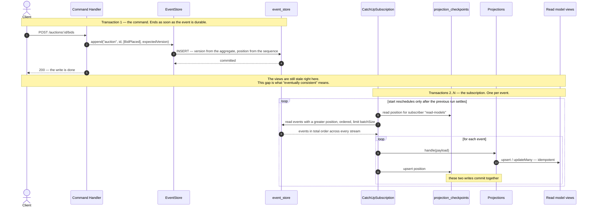
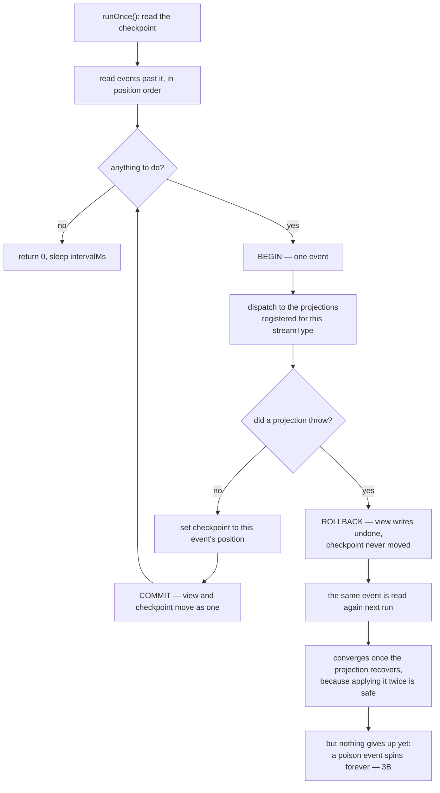

# Change Journal — BidFlow

A record of what we changed each day: **what**, **why**, and **which pattern** it relates to.
Newest entry on top. Date format: `YYYY-MM-DD`.

---

## 2026-08-20 — Step 3A: projections leave the command transaction

**Topic:** read models stop being written by the command and start being *pulled* from the event log by a subscriber that remembers where it stopped. Three sub-steps: the log gets a global order and the subscriber gets a bookmark (3A.1), the subscriber is written (3A.2), the switch is flipped (3A.3).

### How it works now

The command and the read models no longer share a transaction. They share a **log**.

The reason both writes must land in one transaction is easiest to see by asking what a crash between them would do:

Note what is *not* in either diagram: any arrow from `EventStore` to a projection. That edge existed until 3A.3 and its removal is the whole step.

### Why `position` and not `version`

`version` is per stream — it orders bids inside one auction and says nothing about whether that bid happened before or after some favoriting in another stream. A subscriber feeding several projections needs a **total order across the whole log**, which is what the new `event_store.position` (`BIGSERIAL`, `@unique`) provides. `version` keeps its own job: optimistic concurrency inside a stream. Two orderings, two purposes, no overlap.

### Decision: one subscriber, not one per projection

A single `"read-models"` checkpoint drives all three projections in `position` order.

Independent checkpoints were the obvious alternative and would give each projection its own failure isolation. Rejected because `favorites_view.auctionId` has a **foreign key** to `watchlist_auction_catalog_view`: let `FavoritesProjection` overtake `AuctionCatalogProjection` and it inserts a favorite for an auction the catalog has not seen yet → FK violation. One ordered subscriber keeps that FK valid **without a schema change**, which closes the "decide what to do about the `favorites_view` FK" item parked since the read/write split.

**The cost, named:** shared fate. One failing projection stalls all of them. The trigger to revisit is **reactors** (sending mail, calling other systems) — those need their own checkpoint so a rebuild does not re-send yesterday's emails.

### Decision: one transaction per event, not per batch

The rule applied: **the transaction boundary should equal the retry boundary.** With a batch-wide transaction a single poison event at position 7 rolls back events 1–6 as well, the checkpoint never moves, and the batch retries forever; step 3B would then have to split the batch anyway to say "*this* event is dead". Per-event costs N round trips instead of one — irrelevant here, and batching is the optimisation to reach for when throughput hurts, made safe by step 2's idempotency.

What actually matters is that **the projection writes and the checkpoint advance sit in the same transaction**. Split them and a crash in between either replays the event (harmless — step 2) or loses it forever (silent corruption). One transaction removes the question instead of answering it.

### Decision: `position` stays out of `IProjection`

Step 2 predicted event metadata would arrive here. It did — but at the **subscription** level, not in `handle`. The checkpoint is the subscriber's bookkeeping ("how far have I read"); a projection answers a different question ("apply this fact to my table"), and none of the three needs `position`. Changing the port before anything consumes the metadata would be textbook premature abstraction. It becomes justified the moment a projection genuinely needs it — a per-row `lastVersion`, or writing `position` into a view for read-your-writes.

### Decision: self-scheduling `setTimeout`, not `setInterval` + a flag

`setInterval` fires on the clock regardless of whether the previous async run finished, so runs overlap: two loops, one checkpoint, the same batch twice. The usual patch is an `isRunning` boolean. Scheduling the next run only *after* the current one settles makes overlap **structurally impossible** — the invariant beats the guard, and the composition root stays stateless.

### Decision: same process, not a worker

`readModels.start()` runs next to `app.listen` — one process, one event loop, one connection pool. `CatchUpSubscription` itself is process-agnostic (`runOnce()` knows nothing about who calls it), so promoting it to a worker later is a **new entry file, not a rewrite**.

**The cost, named:** two API instances would mean two subscribers on one checkpoint with no locking — duplicated work and a race on `position`. Idempotency keeps the views correct, so this is waste rather than corruption, but **the app is only correct as a single instance** until 3B adds a lock.

### What changed

- `EventStore` lost its projection map and its dispatch loop. Appending events and notifying readers were two jobs in one class — and `IEventStore` never claimed the second one, so the port was right all along and the implementation had drifted past it.
- `CatchUpSubscription` (`shared/infrastructure/`): reads the checkpoint, takes events with `position` greater than it in ascending order, and for each one opens a transaction covering dispatch + checkpoint. `upsert` on the checkpoint because the first run has no row; `gt` not `gte` because the checkpoint means "last position finished".
- Events with a `streamType` nobody subscribes to still advance the checkpoint. "I read it", not "I stored something" — otherwise the subscriber stalls on the first event that does not concern it.
- Integration tests changed shape. `favorites` drains the subscription through an explicit `project()` helper instead of sleeping — the payoff of keeping `runOnce()` public. The "already favorited" case deliberately skips it: that rule lives in the aggregate, reconstituted from the event store, so it is immediately consistent. The contrast between *aggregate = now* and *view = shortly* is the clearest CQRS lesson in the suite.

### The guarantee that inverted

`atomicity.integration.test.ts` asserted "a failing projection rolls back the event". That is **no longer true and must not be**: a read model is a disposable cache and has no business vetoing a command. Rewritten around what is atomic now — projection writes plus the checkpoint — with the inversion stated in a comment rather than the old test quietly deleted. Its four cases: the command commits before anything projects; a failing projection does not roll the command back; a partial batch rolls back writes *and* checkpoint together; redelivery converges once the projection heals.

### Costs carried into 3B / 3C

- **The `BIGSERIAL` gap trap** is now live and is the most dangerous thing in this code: `position` is assigned when the row is created, not when the transaction commits, so a slow transaction can commit *behind* an already-read position and be **skipped forever**. Planned fix: read only past `pg_snapshot_xmin(pg_current_snapshot())`. Researched, not yet prototyped here.
- **A poison event spins the loop forever**, logging on every pass. The `try/catch` in `start()` is not optional — an unhandled rejection in a timer callback kills the Node process — but it converts a crash into an infinite retry. Retry limits + dead-letter are 3B.
- **`FavoriteAuctionHandler` now reads an eventually consistent catalog to make a domain decision.** A freshly created auction can produce a false 404. Visible in miniature in the favorites test, which must project before it can favorite. 3C.
- `payload` comes back from the database as JSON, so `Date` fields arrive as ISO **strings** while the TypeScript type still says `Date`. Harmless today (verified: Prisma accepts `Date | string` on `DateTime` inputs, and no projection calls a date method), but it is a live landmine for the first person who writes `e.startsAt.getTime()`.

### Verification

- `tsc --noEmit` clean, **63 tests green** in 8 suites.
- Before wiring, a throwaway script proved the subscription end-to-end against `bidflow_test` with an `EventStore` built with **no** projections, so only the subscriber could fill the views: 3 events → views built, checkpoint at 3; a second `runOnce()` → 0 events; checkpoint rewound to 0 and replayed → byte-identical views.
- The favorites suite was checked for teeth by mutation: stubbing `project()` out to a no-op fails **5 of 6** tests. The one that survives needs no projection at all.

---

## 2026-08-20 — Step 2: idempotent projections

**Topic:** groundwork for async projections. While projections run inside the command transaction every event reaches them exactly once; behind a catch-up subscription the same event can arrive twice (rebuild, rewound checkpoint, retry). All three projections assumed exactly-once.

### Two ways idempotency was broken — and only one of them is loud
- **Assuming a row exists** (`create` / `update` / `delete`) → `P2002` / `P2025` on redelivery. Loud, harmless: you see it immediately.
- **Relative writes** (`totalBids: { increment: 1 }`) → silently doubles. **The dangerous one.**

### The decision: where does `totalBids` come from
`BidPlacedEvent` did not know which bid in order it was, so the counter could not be turned into an absolute value without a choice. Three candidates:

- **A. Enrich the event** with `bidNumber` — projection writes `totalBids: e.bidNumber`.
- **B. Dedup marker per row** (`lastVersion` in every view table, skip events at or below it) — the general mechanism, covers every case at once.
- **C. Do nothing**, and rely on the checkpoint committing in the same transaction as the view write (effectively-once).

**Chose A.** C is a guarantee that only holds until someone rebuilds without truncating, rewinds a checkpoint, or projects into something outside Postgres. B is the better general answer but needs projections to receive event *metadata* (the version), i.e. a changed `IProjection.handle` signature — and that metadata arrives naturally in step 3 together with `position`. Building it now would be **premature abstraction**. A is the smallest thing that solves the actual problem, and `bidNumber` is a genuine domain fact ("that was the 7th bid"), not a field bolted on for the read model.

Free pass taken knowingly: the event store was empty after the step-1 reset, so no historical `BidPlaced` lacks the field. In a live system changing an event contract needs a tolerant reader or upcasting — **events are immutable, they never get backfilled**.

### What changed
- `BidPlacedEvent` gained `bidNumber`. `Auction` gained `bidCount`, incremented **only in `apply`** — `placeBid` builds the event with `this.bidCount + 1` *before* `applyAndRecord` applies it, so the write path and `reconstitute` produce identical state. Mutating state anywhere but `apply` is what breaks that equality.
- `cancel()` now reads `if (this.bidCount > 0)` instead of `currentHighestBid !== null`. Equivalent, but it states the rule in the same words as the error name.
- All three projections translated: `create` → `upsert`, `update` → `updateMany`, `delete` → `deleteMany`, `{ increment: 1 }` → `e.bidNumber`. `FavoritesProjection.AuctionFavorited` was already an `upsert` — idempotent since the day it was written.
- `updateMany`/`deleteMany` are not about touching many rows (the `where` still targets one PK) — they are Prisma's idiom for "…if it exists": `update` throws `P2025` on zero matches, `updateMany` returns `{ count: 0 }`.

### The cost, named
**A loud failure became a silent no-op.** A missing row used to abort the command; now it passes unnoticed and the read model quietly drifts — the worst failure mode. Not fixed here because the fix needs somewhere to report "this event did not stick": retry + dead-letter, i.e. step 3. **Open decision for step 3:** what `count === 0` on `BidPlaced` should mean — a log line or a dead-lettered event.

### Verification
- `tsc --noEmit` clean, 62 tests green.
- Idempotency proven empirically with a throwaway script against `bidflow_test`: `AuctionCreated` + two `BidPlaced` → `totalBids=2`; **replaying the same three events → still `totalBids=2`**; `AuctionClosed` twice → no exception. The old code would have produced `4` and a `P2025`.
- The `update` branch of the `AuctionCreated` upsert deliberately resets `totalBids: 0` / `currentBid: null`. Idempotency here means **convergence when a prefix of history is replayed**, not "never touch existing rows" — a rewind past `AuctionCreated` replays the bids right after it.

---

## 2026-08-20 — Step 1: clear the schema drift, isolate the test database

**Topic:** groundwork before async projections. Two chores that block the next stage: the database had drifted away from the repo, and integration tests were TRUNCATE-ing the **dev** database.

### 1A — Drift removed

An abandoned async-projections experiment had left the database **ahead of the repo**: `event_store.position`, a `projection_checkpoints` table (with `status` / `failedPosition` / `lastError`) and two rows in `_prisma_migrations` — while `schema.prisma`, the migration `.sql` files and all TypeScript had been reverted. Two empty migration directories were the only trace left in the tree (a `git clean -f` without `-d` removes untracked files but keeps the directories).

- Removed the two empty migration directories — Prisma reads *every* directory under `prisma/migrations/` and needs a `migration.sql` in each, so they would have failed the reset before it started.
- Deleted `src/generated/prisma` — the generated client still exported `ProjectionCheckpoint`, i.e. the type system was advertising a table that exists in neither the schema nor the database. Generated code is disposable; it is gitignored precisely because it is a *function of the schema*.
- `prisma migrate reset` — drop, then replay all 6 migrations from the repo. **The same mechanism as `Auction.reconstitute(events)`**: state comes from replaying a history, never from patching by hand. Prisma refuses this command when it detects an AI agent invoking it, and demands explicit human consent — a good guard.

Rule restated: **the repo is the source of truth, the database is its reflection.** `migrate reset` is dev-only; production gets `migrate deploy`, which only applies what is missing and never drops.

### 1B — Separate test database

`favorites.integration.test.ts` and `atomicity.integration.test.ts` open with `TRUNCATE`, and they were pointing at `DATABASE_URL` — the dev database. One `npm test` wiped local data.

- `DATABASE_URL_TEST` → `bidflow_test` (same container, separate database).
- `jest.setup.ts`, registered as `setupFiles`, overwrites `process.env.DATABASE_URL` with it. **It has to be `setupFiles`, not a `beforeAll` hook:** the tests build `new PrismaPg(...)` at *module import* time, and `setupFiles` is the only jest phase that runs before the test module is loaded. (`dotenv` never overrides an already-set variable, so the swap survives the `import "dotenv/config"` inside each test file.)
- `scripts/testDatabaseUrl.ts` — one guard, three refusals: no `DATABASE_URL_TEST`, a value equal to `DATABASE_URL`, or a database name not ending in `_test`. A destructive test suite should be **structurally unable** to point at the wrong database, not merely configured not to.
- `npm run db:test:migrate` (`scripts/migrate-test-db.ts`) applies migrations to the test database with `migrate deploy` — apply-only. The script re-uses the same guard, so there is a single definition of "which database is the test one".

### Verification
- Database: 5 tables, no `projection_checkpoints`, `event_store` without `position`, 6 migrations.
- `tsc --noEmit` clean; **62 tests green** in 8 suites.
- After a full run: `bidflow_test` holds the test rows (`event_store=4`), `bidflow` is untouched at `0` — proof the redirection works.
- Guard smoke-tested by pointing `DATABASE_URL_TEST` at the dev database: it throws before a single query runs.

### Notes
- `docker-compose.yml` **is** in the repo (the note in `CLAUDE.md` claiming otherwise was stale) — removed.
- Pre-existing, untouched: `npm run lint` already fails on `./src` (Biome import-organization findings from before this change).

## 2026-07-28 — Step 5: slim `favorites_view`, join the catalog at read time

**Topic:** `favorites_view` duplicated title/status/currentBid/currency/startsAt from the auction, so every auction change had to be copied into every watcher's row. Removed the duplication now that the Watchlist owns a catalog to join against.

### What changed
- `favorites_view` → `(bidderId, auctionId, favoritedAt)` + FK to the catalog. Both indexes dropped: the PK covers `bidderId` lookups, and nothing filters by `auctionId` any more.
- `GetMyFavorites` filters and orders through the relation (`where: { auction: { status } }`, `orderBy: { auction: { startsAt } }`, `include`). **DTO shape unchanged → API contract unchanged.**
- `FavoritesProjection` lost the catalog lookup **and four event cases** (`AuctionStarted`, `BidPlaced`, `AuctionClosed`, `AuctionCancelled`) — nothing left to refresh or enrich.

### The real payoff: one point of contact between contexts
`FavoritesProjection` **no longer subscribes to Auction events at all** — it is gone from the `auction` list in `index.ts`. All cross-context event consumption now lives in `AuctionCatalogProjection`. One seam instead of two.

Fan-out is gone with it: `BidPlaced` used to `updateMany` across every watcher's row; it now updates a single catalog row whether the auction has 3 watchers or 30,000. Verified live — started an auction and placed a bid, the favorites list reported `ACTIVE` / `bid: 555` with **zero writes to `favorites_view`**.

### The cost (named, not hidden)
The covering index `(bidderId, startsAt, auctionId)` is unrecoverable — `startsAt` lives in another table now. Reads became a join with an order-by on the joined column. Invisible at tens of favorites per user, visible at tens of thousands → that's when keyset pagination stops being optional.

### Side effect worth tracking
The FK now enforces "cannot favorite an auction missing from the catalog" — the invariant we were hand-checking with `findUniqueOrThrow`. **Entry condition for async projections:** once the catalog and favorites catch up independently, that FK will start rejecting writes; it needs either `relationMode = "prisma"` or an ordering guarantee.

Operational note: `prisma migrate dev` refuses destructive changes non-interactively — had to empty `favorites_view` first. The dropped columns are exactly what the join now supplies, so nothing was actually lost.

### Status
Typecheck clean, 62 tests green. Verified live: ordering by the joined `startsAt`, filtering by the joined `status`, and status/bid propagation without touching `favorites_view`.

New/changed: `+ migration 20260728192133`, `~ schema.prisma`, `~ GetMyFavorites`, `~ FavoritesProjection` (now Watchlist-only), `~ index.ts`, `~ favorites.integration.test.ts` (wiring + two stale comments).

---

## 2026-07-28 — Watchlist owns its auction read model (and why that was the fix)

**Topic:** the Watchlist read `active_auctions_view` — a read model owned by the *Auction* context — to decide whether an auction can be favorited. A mentor suggested a separate read model. He was right.

### The problem
1. **Naming** — `getSnapshot()`; in ES a *snapshot* is serialized aggregate state, this was a read-model query.
2. **Coupling to a private table** — the contract between contexts is the **Published Language** (events), never another context's tables.
3. **A real bug** — `ActiveAuctionsProjection` **deletes** the row on `Closed`/`Cancelled` (correct for *its* question). The Watchlist read the missing row as "does not exist" and returned 404 for a cancelled auction. An implementation detail of one context's projection leaked out as a wrong domain error in another.

### Why a *separate* read model was the answer
Both views are built from the **same events** but encode **different truths**:

| | `active_auctions_view` | `watchlist_auction_catalog_view` |
|---|---|---|
| Question | "what is on sale now?" | "what do I know about this auction?" |
| `AuctionCancelled` | `delete` — it's gone | `update status` — it changed state |
| Owner | Auction | Watchlist |

There is no "auctions table" — there are as many projections as there are questions. Reusing one view for a second question forces that question to inherit the first one's semantics, and *that* was the bug. Cost: a third copy of auction data. That is the price of context autonomy, and it is correct.

### What we did
- `+ WatchlistAuctionCatalog` — only fields the Watchlist asks about; **never deletes** (`Closed`/`Cancelled` → status update), fed by `+ AuctionCatalogProjection` on `streamType: "auction"`.
- **ACL now translates instead of forwarding**: `AuctionSnapshot { exists, status }` → `AuctionForFavoriting { exists, isUpcoming }`, `getSnapshot` → `findForFavoriting`. The aggregate no longer knows what `"SCHEDULED"` means; the *rule* ("only upcoming can be favorited") stays in the aggregate, only the *vocabulary translation* moved out.
- `FavoritesProjection` reads the Watchlist catalog; its silent `if (!auction) return` became `findUniqueOrThrow`. A projection handles facts that already happened — `AuctionFavorited` is only emitted after the handler validated against the same catalog in the same tx, so a missing row is a **broken invariant**. `return` = silent permanent data loss; `throw` rolls back the command. **Caveat: once projections go async a throw becomes a poison message — needs retry + dead-letter first.**
- Regression test added and **verified to have teeth** (pointed the ACL back at the old table → it failed with `AuctionToFavoriteNotFoundError`).
- Collateral: both integration tests `TRUNCATE` a hardcoded table list that missed the new table; `favorites.integration.test.ts` builds its own object graph and had to learn the new projection.

### Side quest: a new projection starts empty
How rebuilds are done in practice — **a dedicated script is the entry-level rung, not the only option**: truncate + reprocess (simplest, downtime) · checkpoint reset (Marten `RebuildProjectionAsync` via code *or CLI*, Axon `resetTokens()`, EventStoreDB checkpoint reset) · blue-green (build v2, replay, switch reads — zero downtime, double storage). Batch + record progress so a replay can resume. **Snapshots do not help here** — they serve aggregate rehydration; a read model needs full history.

**A rebuild is not a migration.** Migrations are SQL, immutable, run once; a replay runs projection *code* and must be repeatable (bug → fix → replay again). A read model in ES is a **cache**: you don't migrate a cache, you rebuild it.

### Key intuition
> Depend on other contexts' **events**, never on their **tables**.
> The ACL earns its place by **translating vocabulary**, not by wrapping a query — if it only forwarded rows it would be a useless layer.
> Query side (no domain decision) → read the view directly, no port. Command side (value feeds an aggregate decision) → port + ACL.

### Deliberately deferred
- ~~**Step 5** — slim `favorites_view` + join to the catalog~~ → **done same day**, see the entry above.
- Replay script (only three local auctions; returns naturally with checkpoints) · unit test for `AuctionCatalogProjection` · wiring duplicated between `index.ts` and the integration test · tests `TRUNCATE` the **dev** DB, so a separate `DATABASE_URL_TEST` is the next cleanup · no compose file in the repo · `prisma migrate dev` does not regenerate the client.

### Status
Typecheck clean, 62 tests green. Verified against the running API: cancelled auction → `422 "Only upcoming (scheduled) auctions..."` instead of `404`; non-existent → still `404`. **Zero references to `activeAuctionView` outside `src/auction/`** (bar assertions in the shared atomicity test).

New/changed: `+ AuctionCatalogProjection`, `+ migration 20260728181517`, `~ schema.prisma`, `~ IAuctionCatalog`, `~ ReadModelAuctionCatalog`, `~ Watchlist(+test)`, `~ FavoriteAuction`, `~ FavoritesProjection`, `~ index.ts`, `~ both integration tests`.

---

## 2026-07-05 — Learning note: transaction boundaries — endpoints, projections, queries

**Topic:** three follow-up questions after wiring the Unit of Work: (1) what if one endpoint calls several handlers (each opens its own transaction)? (2) do projections need transactions? (3) do queries (GETs) need them?

### 1. Endpoint calling multiple handlers → design smell, not a missing feature
- CQRS invariant: **one request → one command → one handler → one aggregate → one transaction.** Vernon's rule: *aggregate boundary = consistency boundary = transaction boundary* — the domain model draws the line, not the endpoint.
- The urge to call two handlers from one endpoint signals either: (a) it's really **one business intention** → model it as one command (maybe the aggregate boundaries are wrong), or (b) it's a **process spanning aggregates** → eventual consistency via events (we already do this: `FavoritesProjection` reacts to Auction events — no cross-context transaction).
- Technically today: each `withBehaviors({ transaction: uow })` handler opens its own tx. Wrapping two handlers in an outer `uow.run()` would NOT work:
  - our `run()` is **not reentrant** — a nested `$transaction` opens an *independent* tx on another connection (Spring vocabulary: we have `REQUIRES_NEW` semantics, composing would need `REQUIRED` = "join if present") + deadlock risk (outer tx holds locks the inner one waits for);
  - **retry breaks**: a `P2002` inside an outer tx aborts the WHOLE Postgres transaction (no further statements allowed) — retry inside it would write into a dead tx. Retry boundary must equal transaction boundary must equal consistency boundary.
- The real-world answer for multi-aggregate processes: **Saga / Process Manager** — a sequence of local transactions linked by events, with **compensating actions** instead of rollback (cancel the flight, don't pretend it never happened). Future stage, needs async event handling first.

### 2. Do projections need transactions? Depends WHOSE transaction
- **Ours today (synchronous projections): yes, the command's tx** — we have no replay mechanism, so a lost view update would be permanent. The price (named!): **a buggy projection fails the command** — read side can take down write side. Acceptable here; the main reason production systems go async.
- **Target ES architecture (async projections): not the command's tx** — but they still need their own consistency story, one of:
  | Strategy | How | Cost |
  |---|---|---|
  | own small tx | update view + save **checkpoint** atomically | local transaction per batch |
  | idempotency | re-applying the same event is harmless → at-least-once delivery suffices | must audit every handler |
- Idempotency audit of our own code: `AuctionStarted → update {status}` idempotent ✅; `AuctionFavorited → upsert` idempotent ✅; `BidPlaced → totalBids: {increment: 1}` **NOT idempotent** ❌ (double-apply counts twice) — first thing to fix when we go async; `AuctionCreated → create` throws on duplicate (handle-able).

### 3. Do queries need transactions? No — and it's CQRS working as designed
- Queries write nothing (nothing to roll back) and never hit version conflicts (retry pointless) → that's why GET handlers are not wrapped in `withBehaviors` at all.
- A single `SELECT` already runs on a consistent snapshot (implicit per-statement transaction in Postgres). Our queries are one `findMany` on one denormalized table — **by design**: projections do the hard joining work at write time so reads are flat.
- If a query ever needed several tables read consistently → smell: reshape the read model (new projection), don't add transactions. Legitimate read-tx cases: multi-SELECT snapshot exports (`REPEATABLE READ`), or read-before-write — but that's a command (`FavoriteAuctionHandler` reads via `uow.client` for exactly this reason).
- Wiring as documentation: query handlers deliberately receive raw `prisma` (not `uow`) — the signature says *"never participates in transactions."*

### Key intuition
> A transaction is not a glue for operations — it's the **expression of a consistency boundary**, and that boundary is drawn by the domain model (the aggregate), not by the endpoint.
> Projections don't need *the command's* transaction — they need **replayability** (checkpoint+tx, or idempotency); borrowing the command's tx is just our simplest way to get it today.
> Commands coordinate many writes → tx. Queries in CQRS make one read from one table → the DB's snapshot already covers them.

---

## 2026-07-05 — Transactions (atomicity): Unit of Work via AsyncLocalStorage + `transaction` behavior

**Topic:** atomic commit of events + projections — the deferred `withTransaction` behavior, unblocked by the Unit of Work pattern.

### The problem
`EventStore.append` did `createMany(events)` and then ran projections as **separate DB ops on separate connections**. Crash (or projection bug) after the event insert → event store says "bid 150", views say "bid 100", **forever** (no replay mechanism exists). Also: multiple events per command updated views partially, and two projections for one event could diverge from each other.

What was already atomic: `createMany` itself (single statement), and every handler saves **one aggregate** (no cross-aggregate atomicity needed — by design).

### The blocker and the pattern
Repos/EventStore/projections are **singletons** with a baked-in `PrismaClient`; a Prisma interactive transaction hands you a `tx` client that somehow must reach all of them for one command only — without polluting `IEventStore`/`IProjection` signatures (domain purity). Solution: **Unit of Work** carried by **`AsyncLocalStorage`** (Node's thread-local for async chains: context is attached to *causality* — whatever an execution schedules inherits its context — so concurrent requests never see each other's value despite one thread).

### What we did
- **`PrismaUnitOfWork`** (`shared/infrastructure/`): `run(fn)` = `prisma.$transaction(tx => als.run(tx, fn))`; `client` getter = `getStore() ?? prisma` (tx inside `run()`, singleton fallback outside → non-transactional code untouched). Typed as `Prisma.TransactionClient` so nobody can call `$transaction` through it (API that makes the mistake impossible > comment).
- **`IUnitOfWork` port** in `shared/application/` — `withBehaviors` never imports Prisma (Dependency Inversion).
- **`EventStore` + both projections + `FavoriteAuctionHandler`** switched to `uow.client` — zero interface changes. (Also fixed FavoritesProjection's wrong `@prisma/client/extension` import.)
- **`withBehaviors` gained `transaction: IUnitOfWork`** — order enforced & tested: **retry wraps transaction** (a conflict aborts the whole PG tx, so each attempt needs a fresh one).
- **Wiring:** all mutating commands run `{ retry: true, transaction: uow }`; `CreateAuction` gets `{ transaction: uow }` only (fresh stream — nothing to conflict with, but still needs atomicity).
- **Proof:** `atomicity.integration.test.ts` with a saboteur projection registered *before* `ActiveAuctionsProjection` — 3 tests: success commits event+view together; with tx a projection failure rolls back the event; **without tx the same failure leaves event persisted + view stale** (the test documents the bug we fixed).

### Pitfall found: parallel Jest workers vs shared DB
First run looked like rollback was broken — it wasn't. Jest runs test **files** in parallel workers; both integration files `TRUNCATE` the same tables, so one wiped the other mid-flight (clue: a test doing exactly what the failing fragment did was passing). Fix: `maxWorkers: 1` in `jest.config.ts` + atomicity assertions scoped to the specific `streamId` instead of global `count()`. Lesson: integration tests sharing a DB must be serialized or data-isolated.

### New / changed files
- `+ src/shared/infrastructure/PrismaUnitOfWork.ts` (+ 4 unit tests, fake `$transaction`, ALS context survival across event-loop hops + concurrent-run isolation)
- `+ src/shared/application/IUnitOfWork.ts`
- `+ src/shared/application/__tests__/withBehaviors.test.ts` (fresh tx per retry attempt)
- `+ src/shared/infrastructure/__tests__/atomicity.integration.test.ts`
- `~ EventStore, ActiveAuctionsProjection, FavoritesProjection, FavoriteAuction` (→ `uow.client`)
- `~ withBehaviors` (`transaction` behavior), `~ index.ts` (wiring), `~ favorites.integration.test.ts` (mirrors prod wiring incl. behaviors), `~ jest.config.ts` (`maxWorkers: 1`)

### Deliberately deferred
- **Async projections** (catch-up subscription + checkpoints) — would replace transactional projections with eventual consistency; next big stage.
- Interactive-transaction timeout is Prisma's default (~5 s) — fine for two projections, revisit if projections grow.

### Documentation
- Updated: `CLAUDE.md` (Current Stage → transactions DONE; parked list now leads with async projections).

### Status
Typecheck clean. Tests: **59 green** (incl. integration). Lint: no new errors (17 pre-existing).

---

## 2026-07-05 — Learning note: transaction isolation & MVCC vs our version counter

**Topic:** what DB transaction isolation actually is, how PostgreSQL's MVCC relates to our optimistic concurrency, and why we don't need it as a guard. (Prompted by mentor: read PostgreSQL docs ch. 13.2.)

### Two separate axes — don't conflate them
- **Transaction isolation** = *how much* protection I want against concurrency anomalies (the goal / guarantee level). Defined by which anomalies are forbidden: dirty read, nonrepeatable read, phantom read, serialization anomaly.
- **Locking (pessimistic / optimistic)** = *how* the DB achieves it (the mechanism). Isolation ≠ pessimistic locking — pessimistic locking is just **one technique** to reach an isolation level.

### The four levels (PostgreSQL implements 3)
| Level | Guarantee | How PG does it |
|---|---|---|
| Read Committed (**PG + Prisma default**) | fresh snapshot **per statement** | MVCC |
| Repeatable Read | one snapshot **per transaction** (Snapshot Isolation) | MVCC + `40001` on conflict |
| Serializable | as if run one-at-a-time | MVCC + read/write-dependency checks |

Higher isolation = fewer locks but more "losers" that must **retry** (`40001 could not serialize`). Same philosophy as our optimistic concurrency.

### "Optimistic" — philosophy vs named pattern (the confusion I had to untangle)
- **Optimistic as a philosophy**: don't block, detect conflict at write, loser retries. Held by BOTH our version counter AND Postgres MVCC.
- **"Optimistic locking" as a named pattern**: version column + retry, lives **in app code**. Postgres does **not** do this for us.
- Postgres reaches high isolation via **MVCC** (multiple row versions + snapshots), which is optimistic *in character* but is a **different mechanism** from our version counter. So: "optimistic locking" is NOT a Postgres isolation method — MVCC is.

### MVCC vs our version counter (Anna vs Bartek, price 100 → both bid)
| | Version counter (ours) | MVCC (Postgres) |
|---|---|---|
| Who holds the reference point? | **us** — event `version` | **DB** — the snapshot |
| What triggers the conflict? | inserting an existing version (`@@unique([streamId, version])`) | commit on a row changed after the snapshot |
| Error | `OptimisticConcurrencyError` (from `P2002`) | `40001 could not serialize` |
| Where the guard lives | our app | inside PostgreSQL |
| What we must set up | version design + `unique` | raise isolation level |

Both end identically: loser gets "conflict" → retries on fresh state.

### Would we "implement MVCC"? What would it take?
- **MVCC is not something you implement** — Postgres always has it, on by default.
- To use it *as the guard*, you'd need: (1) wrap read+write in **one transaction**, (2) set `isolationLevel: 'Serializable'`, (3) catch `40001` and retry (our `retryOnConcurrencyConflict` already exists — just teach it `40001` too).
- **Isolation level is a property of a transaction** — no transaction, nothing to isolate. So yes, MVCC-as-guard requires introducing transactions.

### Is MVCC the only mechanism? No — Postgres offers a whole spectrum
MVCC is the **backbone** (all three isolation levels stand on it), but the docs describe more, sitting alongside/on top of it:
| Mechanism | Character | Who turns it on |
|---|---|---|
| MVCC / snapshots | optimistic | always, automatic |
| Row **write lock** (2nd writer to same row **waits** for the 1st to commit/rollback) | pessimistic (implicit) | always, automatic |
| `SELECT ... FOR UPDATE` / `FOR SHARE`, table locks | pessimistic (explicit) | **us**, opt-in |
| Predicate locks (`SIReadLock`, Serializable only) | **detection**, does NOT block | DB, automatic |

Takeaways:
- MVCC is **not** 100% lock-free — writes to the **same row** are serialized by an implicit write lock (docs: *"the would-be updater will wait for the first updating transaction to commit or roll back"*).
- Postgres gives us **both worlds in one DB**: optimistic by default (MVCC), and one command (`FOR UPDATE`) flips a given operation to pessimistic blocking → the "hybrid per operation" from the previous journal entry.
- So we now have the full set of three approaches, all available at once: **optimistic (MVCC)**, **explicit pessimistic (`FOR UPDATE`)**, and our **app-level version counter**.

### Verdict for BidFlow
- We **don't** need MVCC as a guard. Event Sourcing is **append-only** — there's no row to `UPDATE`, so the natural concurrency guard is the **stream version** (`@@unique([streamId, version])`). That's the canonical ES pattern, and we already have it. MVCC/Serializable is the tool for the classic mutate-in-place model (`UPDATE accounts SET balance = ...`) where there's no version to check.
- The real reason to introduce transactions is **atomicity, not isolation**: today `EventStore.append` does `createMany(events)` and then updates projections as **two separate DB ops** — a crash between them leaves the read model stale. Wrapping both in one transaction gives "all-or-nothing." → this is exactly the deferred **`withTransaction`** behavior.

### Key intuition
> **Isolation** = "how much protection." **Locking** = "by what method." Not synonyms — a goal level vs a mechanism.
> Postgres reaches isolation via **MVCC** (optimistic in style, DB is the guard); our version counter is optimistic too but the guard lives in **our** code.
> Event Sourcing already ships its own guard (stream version), so for us transactions are about **atomicity** (events + projections together), not isolation.

---

## 2026-07-05 — Learning note: optimistic vs pessimistic locking

**Topic:** how the two concurrency-control strategies differ, and how to pick one per operation.

### Core difference
- **Optimistic** assumes conflicts are **rare**: act freely, detect the clash **at write time** (version mismatch) → error → retry or report. Never blocks. Zero happy-path cost, scales well under low contention. Fits stateless HTTP and Event Sourcing (stream version is built in).
- **Pessimistic** assumes conflicts are **likely**: **lock up front** at read time (`SELECT ... FOR UPDATE`), others wait their turn. No conflict happens because the second writer queued. Constant cost per op; risks deadlocks and lower throughput; needs the transaction held open.

| Dimension | Optimistic | Pessimistic |
|---|---|---|
| Assumption | conflicts rare | conflicts likely |
| Blocks? | never (detects at write) | yes (locks at read) |
| Mechanism | version / timestamp | DB row lock |
| On conflict | write rejected → retry | second writer just waited |
| Happy-path cost | zero | constant (everyone pays) |
| Main risk | wasted work / livelock | deadlock / queuing |
| Fits stateless + ES | naturally | awkwardly |

### Decision rule (three questions)
1. Are collisions **frequent** (everyone hits the same row)? → pessimistic (high contention kills retry).
2. Is **re-running** the operation expensive/dangerous (side effects)? → pessimistic.
3. Is the op **short** and the system **stateless** (HTTP)? → optimistic.

All three point to optimistic → optimistic. Any strong pessimistic signal (esp. money or a uniquely physical resource) → consider a lock.

### Real-world examples
- **Optimistic:** editing your profile/settings; wiki & shared docs (Confluence — can't hold a lock for 10 min of editing); shopping cart edits; Jira/Linear tickets; **BidFlow bidding**.
- **Pessimistic:** bank transfers / account balance (no risk of double-spend); reserving a specific seat (cinema/flight — one physical 14C); last item in a flash sale (high contention → optimistic would livelock); invoice-number sequence generator; batch jobs that must not run twice.

### Key intuition
> Money and physically-unique resources (this seat, this last unit) → usually **pessimistic**.
> "My own" or rarely-shared data (profile, doc, ticket, auction bid) → usually **optimistic**.
> Many real systems are **hybrid** — catalog & cart optimistic, final stock decrement pessimistic. Choose **per operation**, not per app.

Mnemonic: optimistic = "act and apologize if needed" (detect at write); pessimistic = "ask permission up front" (lock at read).

---

## 2026-07-05 — Concurrency control: retry + behaviors decorator

**Topic:** optimistic concurrency control and a retry mechanism as a cross-cutting concern.

### What we did
- **Finalized optimistic concurrency** — confirmed both aggregates (`Auction`, `Watchlist`) hold `persistedVersion` (the version at load time), and the event store enforces `@@unique([streamId, version])`; a `P2002` conflict becomes `OptimisticConcurrencyError`.
- **Moved `OptimisticConcurrencyError`** from `shared/infrastructure/EventStore.ts` to `shared/domain/OptimisticConcurrencyError.ts` — so the application layer can catch it without breaking the "dependencies point inward" rule.
- **Added `retryOnConcurrencyConflict`** (`shared/application/`) — retries the **whole cycle** load→decide→save (not just the save!), because after a conflict the in-memory aggregate is stale. It retries only on `OptimisticConcurrencyError`; any other error (including a legitimate domain rejection) propagates immediately. Unit test covers 4 cases.
- **Introduced the `withBehaviors(handler, { retry: true })` decorator** (`shared/application/`) + a shared `CommandHandler` interface — retry is applied **declaratively at wiring time in `index.ts`**, not hand-wrapped in each handler. Handlers returned to their clean form (removed inline retry from 5 handlers).
- **Covered all commands that mutate an existing aggregate with retry:** `PlaceBid`, `CancelAuction`, `StartAuction`, `FavoriteAuction`, `UnfavoriteAuction`. `CreateAuction` is **excluded** — it opens a fresh stream (version 0), so a conflict would mean a UUID collision, which we don't retry.

### Why
- Retry and (future) transactionality are **cross-cutting concerns** — not the logic of any single command. Pattern: **Decorator** (declared in one place, handlers stay pure).
- `placeBid` is the textbook case: after a retry the bid is **re-validated** against the fresh highest bid → the loser correctly gets `BidTooLowError`. Retry = re-running the domain rules, not blindly repeating a save.
- Future behavior composition: `retry( transaction( handler ) )` — retry outermost (fresh transaction after a rollback), transaction innermost.

### Deliberately deferred
- **`withTransaction`** — the seam exists in `withBehaviors`, but it needs a **Unit of Work** (per-request repositories bound to `tx`; today they're singletons with a baked-in `prisma`). Not building it ahead of need (premature abstraction).
- The decorator wraps the **entire** `execute` — in `FavoriteAuction`, a conflict will also re-run the idempotent ACL read (`activeAuctionView`). Acceptable cost (conflicts are rare, the read is cheap).

### New / changed files
- `+ src/shared/domain/OptimisticConcurrencyError.ts`
- `+ src/shared/application/CommandHandler.ts`
- `+ src/shared/application/withBehaviors.ts`
- `+ src/shared/application/retryOnConcurrencyConflict.ts` (+ test)
- `~ src/shared/infrastructure/EventStore.ts` (imports the error from domain)
- `~ src/auction/api/errorHandler.ts` (imports the error from domain)
- `~ handlers: PlaceBid, CancelAuction, StartAuction, FavoriteAuction, UnfavoriteAuction` (clean, `implements CommandHandler`)
- `~ src/index.ts` (wired via `withBehaviors({ retry: true })`)

### Documentation
- Updated: `CLAUDE.md` (Current Stage → concurrency DONE).
- To consider (flagged, untouched): `ABOUT.md` is stale (predates the Watchlist context); `DOMAIN_REVIEW.md` question #7 is effectively resolved.

### Status
Typecheck clean. Tests: 43 green (excluding integration tests, which require a database).